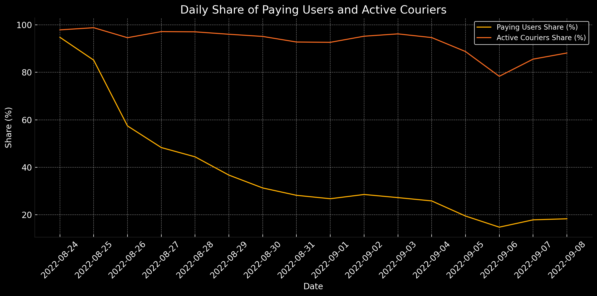
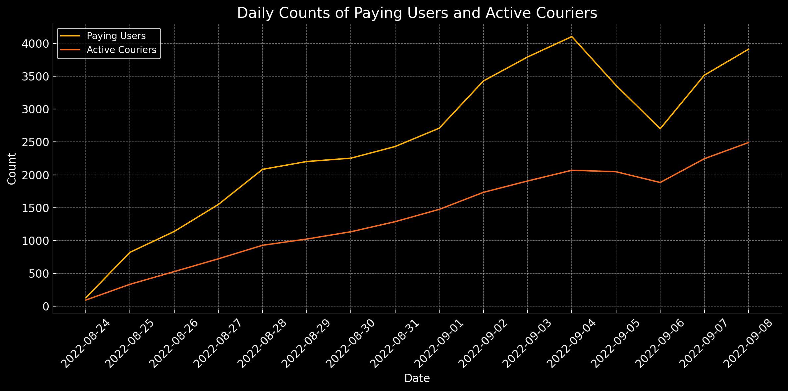
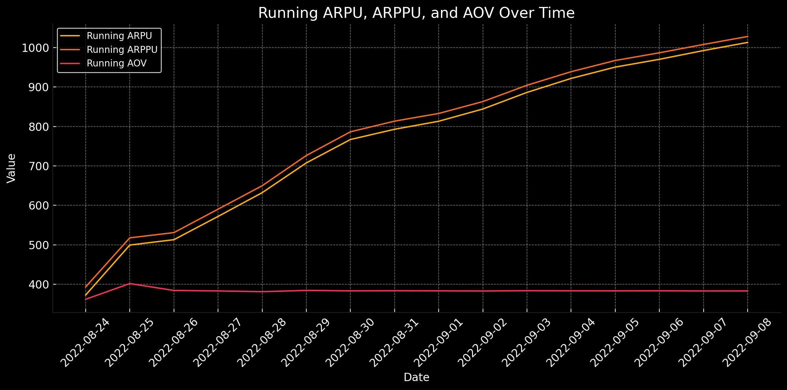
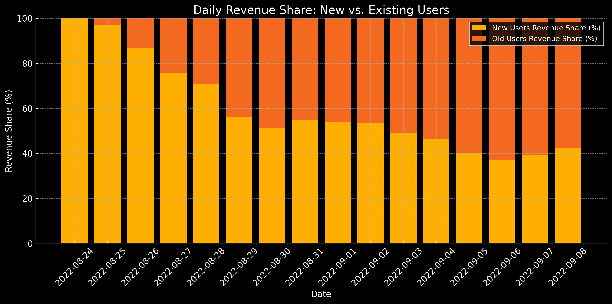
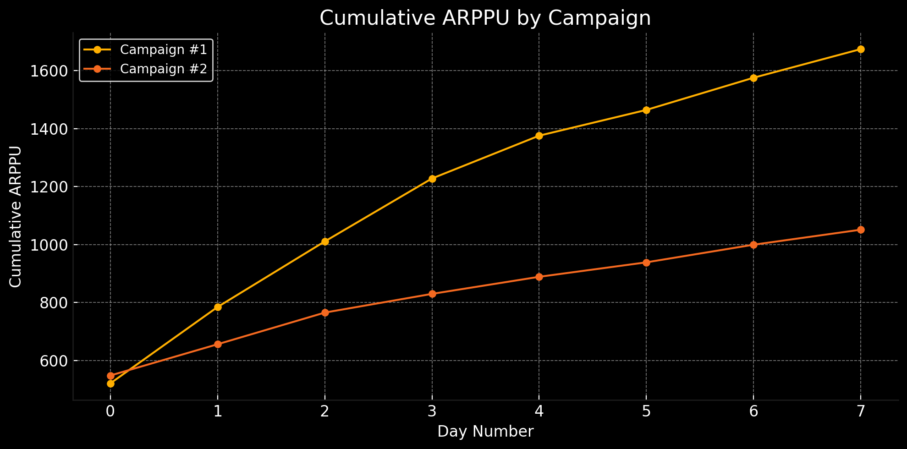
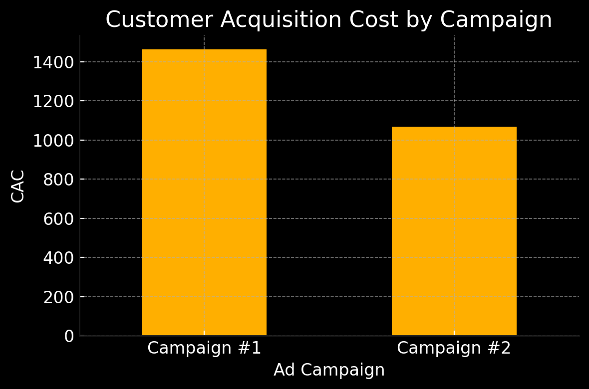

# Introduction
This project is based on the [SQL Simulator course](https://karpov.courses/simulator-sql) by karpov.courses. Below are five examples drawn from the course’s more than 150 tasks. In this project, we explore dynamics in key product and marketing metrics—Average Revenue Per User (ARPU), Average Revenue Per Paying User (ARPPU), Average Order Value (AOV), Customer Acquisition Cost (CAC), and retention—and analyze revenue trends as well as the impact of ad campaigns.

### Here are the questions explored through SQL queries:

1. What are the trends over time in paying users and active couriers?
2. How do ARPU, ARPPU, and AOV perform over time?
3. What share of daily revenue comes from new users versus existing users?
4. What is the user retention rate over time?
5. Which ad campaign was more impactful?

# Tools I Used

- SQL
- Redash
- VS Code
- Git & GitHub

# The Analysis

### 1. Dynamics of Paying Users and Active Couriers
This query calculates, for each date, the daily share of paying users and active couriers by dividing each day’s counts by the cumulative totals as of the previous day.

```sql
SELECT
    date,
    paying_users,
    active_couriers,
    ROUND(
        paying_users::DECIMAL / COALESCE(
            (
                new_users + SUM(new_users) OVER (
                    ROWS BETWEEN UNBOUNDED PRECEDING
                    AND 1 PRECEDING
                )
            ),
            new_users
        ) * 100,
        2
    ) AS paying_users_share,
    ROUND(
        active_couriers::DECIMAL / COALESCE(
            (
                new_couriers + SUM(new_couriers) OVER (
                    ROWS BETWEEN UNBOUNDED PRECEDING
                    AND 1 PRECEDING
                )
            ),
            new_couriers
        ) * 100,
        2
    ) AS active_couriers_share
FROM
    (
        SELECT
            DATE (TIME) AS date,
            COUNT(DISTINCT user_id) AS paying_users
        FROM
            user_actions
        WHERE
            order_id IN (
                SELECT DISTINCT
                    order_id
                FROM
                    courier_actions
                WHERE
                    order_id NOT IN (
                        SELECT
                            order_id
                        FROM
                            user_actions
                        WHERE
                            ACTION = 'cancel_order'
                    )
            )
        GROUP BY
            date
    ) t1
    JOIN (
        SELECT
            DATE (TIME) AS date,
            COUNT(DISTINCT courier_id) AS active_couriers
        FROM
            courier_actions
        WHERE
            order_id NOT IN (
                SELECT
                    order_id
                FROM
                    user_actions
                WHERE
                    ACTION = 'cancel_order'
            )
        GROUP BY
            date
    ) t2 USING (date)
    JOIN (
        SELECT
            date,
            COUNT(DISTINCT user_id) AS new_users,
            COUNT(DISTINCT courier_id) AS new_couriers
        FROM
            (
                SELECT
                    user_id,
                    MIN(TIME)::DATE AS date
                FROM
                    user_actions
                GROUP BY
                    user_id
            ) t3
            JOIN (
                SELECT
                    courier_id,
                    MIN(TIME)::DATE AS date
                FROM
                    courier_actions
                GROUP BY
                    courier_id
            ) t4 USING (date)
        GROUP BY
            date
    ) t5 USING (date)
ORDER BY
    date;
```

Breakdown of user and courier dynamics:

- **Steep early decline in paying­‑user share:** On 24 Aug 2022, almost all users (~94.8 %) were “paying” users; by 26 Aug, that share had already fallen to ~57 %, and it bottomed at ~14.8 % on 6 Sept. This suggests a rapid influx of new (non‑paying) users outpacing the growth of paying users.

- **Active‐courier share remains high but dips mid‑period:** At the start, ~98 % of couriers who ever joined were active on a given day; by 31 Aug it slipped to ~92.8 %, dipped to ~78.3 % on 6 Sept, then recovered to ~88 % by 8 Sept. New couriers tend to be less active immediately after joining, with activity “catching up” later.

- **Partial recovery after the low point:** Both metrics rebound somewhat after their minima on 6 Sept, indicating that as the user/courier base matures, a higher fraction engages (or re‑engages) in paying/orders.


*Line chart visualizing the daily share of paying users and active couriers; the chart is generated by ChatGPT*


*Line chart visualizing the daily counts of paying users and active couriers; the chart is generated by ChatGPT*

### 2. Evolution of Running ARPU, ARPPU, and AOV
This query computes, for each date, the running ARPU, ARPPU, and AOV by dividing cumulative revenue to date by the cumulative counts of all users, paying users, and orders, respectively.

```sql
SELECT
    date,
    ROUND(
        SUM(revenue) OVER (
            ORDER BY
                date
        ) / SUM(new_users) OVER (
            ORDER BY
                date
        ),
        2
    ) AS running_arpu,
    ROUND(
        SUM(revenue) OVER (
            ORDER BY
                date
        ) / SUM(new_paying_users) OVER (
            ORDER BY
                date
        ),
        2
    ) AS running_arppu,
    ROUND(
        SUM(revenue) OVER (
            ORDER BY
                date
        ) / SUM(orders) OVER (
            ORDER BY
                date
        ),
        2
    ) AS running_aov
FROM
    (
        SELECT
            date,
            revenue,
            orders,
            new_users,
            new_paying_users
        FROM
            (
                SELECT
                    date,
                    SUM(price) AS revenue,
                    COUNT(DISTINCT order_id) AS orders
                FROM
                    (
                        SELECT
                            DATE (creation_time) AS date,
                            UNNEST(product_ids) AS product_id,
                            order_id
                        FROM
                            orders
                        WHERE
                            order_id NOT IN (
                                SELECT
                                    order_id
                                FROM
                                    user_actions
                                WHERE
                                    ACTION = 'cancel_order'
                            )
                    ) t1
                    JOIN products USING (product_id)
                GROUP BY
                    date
            ) t2
            LEFT JOIN (
                SELECT
                    date,
                    COUNT(user_id) AS new_users
                FROM
                    (
                        SELECT
                            user_id,
                            MIN(TIME::date) AS date
                        FROM
                            user_actions
                        GROUP BY
                            user_id
                    ) t3
                GROUP BY
                    date
            ) t4 USING (date)
            LEFT JOIN (
                SELECT
                    date,
                    COUNT(user_id) AS new_paying_users
                FROM
                    (
                        SELECT
                            user_id,
                            MIN(TIME::date) AS date
                        FROM
                            user_actions
                        WHERE
                            order_id NOT IN (
                                SELECT
                                    order_id
                                FROM
                                    user_actions
                                WHERE
                                    ACTION = 'cancel_order'
                            )
                        GROUP BY
                            user_id
                    ) t5
                GROUP BY
                    date
            ) t6 USING (date)
    ) t7
ORDER BY
    date;
```

Breakdown of main product metric dynamics:

- **Steady growth in ARPU & ARPPU:** Both metrics rise monotonically from ~372 MDL to ~1,013 MDL (ARPU) and ~393 MDL to ~1,028 MDL (ARPPU), indicating total spend per user and per paying user nearly triples over the period.

- **Narrowing gap between ARPU and ARPPU:** The difference shrinks from ~20 MDL to ~15 MDL, reflecting a consistently high share of active, paying users.

- **Stabilized average order value:** Running AOV spikes early (peaking at ~402 MDL on 25 Aug), then quickly settles around ~383 MDL, suggesting that once the marketplace matures, the typical order size becomes very consistent.


*Line chart visualizing running ARPU, ARPPU, and AOV over time; the chart is generated by ChatGPT*

### 3. Comparison of Revenue by Customer Group
This query calculates, for each date, total revenue, new‑user revenue, and the percentage share of revenue from new versus existing users.

```sql
SELECT
    date,
    revenue,
    new_users_revenue,
    ROUND(new_users_revenue / revenue * 100, 2) AS new_users_revenue_share,
    ROUND((revenue - new_users_revenue) / revenue * 100, 2) AS old_users_revenue_share
FROM
    (
        SELECT
            first_order_date AS date,
            revenue,
            SUM(new_revenue) AS new_users_revenue
        FROM
            (
                SELECT
                    first_order_date,
                    SUM(price) AS new_revenue
                FROM
                    (
                        SELECT
                            DATE (creation_time) AS date,
                            UNNEST(product_ids) AS product_id,
                            order_id,
                            user_id
                        FROM
                            orders
                            LEFT JOIN user_actions USING (order_id)
                        WHERE
                            order_id NOT IN (
                                SELECT
                                    order_id
                                FROM
                                    user_actions
                                WHERE
                                    ACTION = 'cancel_order'
                            )
                    ) t1
                    LEFT JOIN products USING (product_id)
                    LEFT JOIN (
                        SELECT
                            user_id,
                            MIN(DATE (TIME)) AS first_order_date
                        FROM
                            user_actions
                        GROUP BY
                            user_id
                    ) t2 USING (user_id)
                WHERE
                    date = first_order_date
                GROUP BY
                    first_order_date
            ) t3
            LEFT JOIN (
                SELECT
                    date,
                    SUM(price) AS revenue
                FROM
                    (
                        SELECT
                            DATE (creation_time) AS date,
                            UNNEST(product_ids) AS product_id
                        FROM
                            orders
                        WHERE
                            order_id NOT IN (
                                SELECT
                                    order_id
                                FROM
                                    user_actions
                                WHERE
                                    ACTION = 'cancel_order'
                            )
                    ) t4
                    LEFT JOIN products USING (product_id)
                GROUP BY
                    date
            ) t5 ON first_order_date = t5.date
        GROUP BY
            first_order_date,
            revenue
    ) t6
GROUP BY
    date,
    revenue,
    new_users_revenue
ORDER BY
    date;
```

Breakdown of new‑user vs. existing‑user revenue comparison:

- **Early dominance of new‑user revenue:** On 24 Aug the entire day’s revenue comes from new users (100 % share), but this quickly declines as existing users’ orders ramp up.

- **Shift toward existing users:** By 28 Aug, new users contribute ~71 % of daily revenue; thereafter their share falls below 60 %, stabilizing around ~40 % by early September.

- **Balancing out:** From 30 Aug to 8 Sept, existing users consistently generate 46 %–62 % of daily revenue, indicating growing repeat purchase behavior.


*Bar chart visualizing daily revenue share of the new vs. existing users; the chart is generated by ChatGPT*

### 4. User Retention Analysis by Cohort
This query groups users into cohorts based on their first interaction date and computes daily retention rates as the fraction of original cohort members remaining active each day.

```sql
SELECT
    DATE_TRUNC('month', start_date)::DATE AS start_month,
    start_date,
    date - start_date AS day_number,
    ROUND(
        COUNT(DISTINCT user_id)::DECIMAL / MAX(COUNT(DISTINCT user_id)) OVER (
            PARTITION BY
                start_date
        ),
        2
    ) AS retention
FROM
    (
        SELECT
            user_id,
            MIN(TIME::DATE) OVER (
                PARTITION BY
                    user_id
            ) AS start_date,
            TIME::DATE AS date
        FROM
            user_actions
    ) t1
GROUP BY
    date,
    start_date
ORDER BY
    start_date,
    day_number;
```
Breakdown of cohort retention analysis:

- **Sharp initial drop:** Across all cohorts, retention crashes from 100 % on Day 0 to 11 %–22 % on Day 1, showing most churn happens immediately after first use.  
- **Consistent mid‑period plateau:** From Day 2 through Day 5, retention rates hold in a tight band (~14 %–18 %), indicating that once users return past the first day, they tend to stick around for several more days.  
- **Long‑term tail:** By Day 10, average retention falls to around 10 %, meaning only about one in ten original users remain active after ten days.

| Start Month | Start Date\Day number |   0 |     1 |     2 |     3 |     4 |     5 |     6 |     7 |     8 |     9 |    10 |    11 |    12 |    13 |    14 |    15 |
|-------------|------------|----:|------:|------:|------:|------:|------:|------:|------:|------:|------:|------:|------:|------:|------:|------:|------:|
|             | 2022-08-24 | 1.00 |  0.14 |  0.15 |  0.18 |  0.19 |  0.14 |  0.12 |  0.16 |  0.10 |  0.15 |  0.11 |  0.15 |  0.07 |  0.05 |  0.05 |  0.07 |
|             | 2022-08-25 | 1.00 |  0.18 |  0.16 |  0.19 |  0.17 |  0.19 |  0.16 |  0.17 |  0.16 |  0.15 |  0.14 |  0.08 |  0.09 |  0.10 |  0.09 |    -  |
|             | 2022-08-26 | 1.00 |  0.22 |  0.20 |  0.22 |  0.17 |  0.15 |  0.15 |  0.14 |  0.14 |  0.15 |  0.09 |  0.09 |  0.10 |  0.09 |    -  |    -  |
| 2022-08-01  | 2022-08-27 | 1.00 |  0.22 |  0.22 |  0.19 |  0.16 |  0.14 |  0.17 |  0.18 |  0.13 |  0.13 |  0.09 |  0.10 |  0.09 |    -  |    -  |    -  |
|             | 2022-08-28 | 1.00 |  0.22 |  0.21 |  0.17 |  0.17 |  0.20 |  0.17 |  0.17 |  0.13 |  0.11 |  0.12 |  0.11 |    -  |    -  |    -  |    -  |
|             | 2022-08-29 | 1.00 |  0.18 |  0.15 |  0.16 |  0.16 |  0.14 |  0.10 |  0.08 |  0.09 |  0.08 |  0.09 |    -  |    -  |    -  |    -  |    -  |
|             | 2022-08-30 | 1.00 |  0.15 |  0.13 |  0.14 |  0.12 |  0.13 |  0.11 |  0.07 |  0.09 |  0.09 |    -  |    -  |    -  |    -  |    -  |    -  |
|             | 2022-08-31 | 1.00 |  0.16 |  0.16 |  0.17 |  0.16 |  0.11 |  0.10 |  0.12 |  0.10 |    -  |    -  |    -  |    -  |    -  |    -  |    -  |
|             | 2022-09-01 | 1.00 |  0.18 |  0.18 |  0.18 |  0.14 |  0.09 |  0.12 |  0.10 |    -  |    -  |    -  |    -  |    -  |    -  |    -  |    -  |
|             | 2022-09-02 | 1.00 |  0.20 |  0.18 |  0.15 |  0.13 |  0.15 |  0.13 |    -  |    -  |    -  |    -  |    -  |    -  |    -  |    -  |    -  |
| 2022-09-01  | 2022-09-03 | 1.00 |  0.21 |  0.18 |  0.12 |  0.14 |    -  |    -  |    -  |    -  |    -  |    -  |    -  |    -  |    -  |    -  |    -  |
|             | 2022-09-04 | 1.00 |  0.16 |  0.13 |  0.16 |  0.16 |    -  |    -  |    -  |    -  |    -  |    -  |    -  |    -  |    -  |    -  |    -  |
|             | 2022-09-05 | 1.00 |  0.11 |  0.12 |  0.15 |    -  |    -  |    -  |    -  |    -  |    -  |    -  |    -  |    -  |    -  |    -  |    -  |
|             | 2022-09-06 | 1.00 |  0.12 |  0.12 |    -  |    -  |    -  |    -  |    -  |    -  |    -  |    -  |    -  |    -  |    -  |    -  |    -  |
|             | 2022-09-07 | 1.00 |  0.17 |    -  |    -  |    -  |    -  |    -  |    -  |    -  |    -  |    -  |    -  |    -  |    -  |    -  |    -  |
|             | 2022-09-08 | 1.00 |    -  |    -  |    -  |    -  |    -  |    -  |    -  |    -  |    -  |    -  |    -  |    -  |    -  |    -  |    -  |

*Cohort retention matrix*

### 5. Ad Campaigns Comparison
This query computes, for each ad campaign and each day since launch, the cumulative ARPPU and the CAC.

```sql
WITH
    main_table AS (
        SELECT
            ads_campaign,
            user_id,
            order_id,
            TIME,
            product_id,
            price
        FROM
            (
                SELECT
                    ads_campaign,
                    user_id,
                    order_id,
                    TIME
                FROM
                    (
                        SELECT
                            user_id,
                            order_id,
                            TIME,
                            CASE
                                WHEN user_id IN (8631, 8632, 8638, 8643, 8657, 8673, 8706, 8707, 8715, 8723, 8732,
                                                8739, 8741, 8750, 8751, 8752, 8770, 8774, 8788, 8791,
                                                8804, 8810, 8815, 8828, 8830, 8845, 8853, 8859, 8867,
                                                8869, 8876, 8879, 8883, 8896, 8909, 8911, 8933, 8940,
                                                8972, 8976, 8988, 8990, 9002, 9004, 9009, 9019, 9020,
                                                9035, 9036, 9061, 9069, 9071, 9075, 9081, 9085, 9089,
                                                9108, 9113, 9144, 9145, 9146, 9162, 9165, 9167, 9175,
                                                9180, 9182, 9197, 9198, 9210, 9223, 9251, 9257, 9278,
                                                9287, 9291, 9313, 9317, 9321, 9334, 9351, 9391, 9398,
                                                9414, 9420, 9422, 9431, 9450, 9451, 9454, 9472, 9476,
                                                9478, 9491, 9494, 9505, 9512, 9518, 9524, 9526, 9528,
                                                9531, 9535, 9550, 9559, 9561, 9562, 9599, 9603, 9605,
                                                9611, 9612, 9615, 9625, 9633, 9652, 9654, 9655, 9660,
                                                9662, 9667, 9677, 9679, 9689, 9695, 9720, 9726, 9739,
                                                9740, 9762, 9778, 9786, 9794, 9804, 9810, 9813, 9818,
                                                9828, 9831, 9836, 9838, 9845, 9871, 9887, 9891, 9896,
                                                9897, 9916, 9945, 9960, 9963, 9965, 9968, 9971, 9993,
                                                9998, 9999, 10001, 10013, 10016, 10023, 10030, 10051,
                                                10057, 10064, 10082, 10103, 10105, 10122, 10134, 10135) THEN 1
                                WHEN user_id IN (8629, 8630, 8644, 8646, 8650, 8655, 8659, 8660, 8663, 8665, 8670,
                                                8675, 8680, 8681, 8682, 8683, 8694, 8697, 8700, 8704,
                                                8712, 8713, 8719, 8729, 8733, 8742, 8748, 8754, 8771,
                                                8794, 8795, 8798, 8803, 8805, 8806, 8812, 8814, 8825,
                                                8827, 8838, 8849, 8851, 8854, 8855, 8870, 8878, 8882,
                                                8886, 8890, 8893, 8900, 8902, 8913, 8916, 8923, 8929,
                                                8935, 8942, 8943, 8949, 8953, 8955, 8966, 8968, 8971,
                                                8973, 8980, 8995, 8999, 9000, 9007, 9013, 9041, 9042,
                                                9047, 9064, 9068, 9077, 9082, 9083, 9095, 9103, 9109,
                                                9117, 9123, 9127, 9131, 9137, 9140, 9149, 9161, 9179,
                                                9181, 9183, 9185, 9190, 9196, 9203, 9207, 9226, 9227,
                                                9229, 9230, 9231, 9250, 9255, 9259, 9267, 9273, 9281,
                                                9282, 9289, 9292, 9303, 9310, 9312, 9315, 9327, 9333,
                                                9335, 9337, 9343, 9356, 9368, 9370, 9383, 9392, 9404,
                                                9410, 9421, 9428, 9432, 9437, 9468, 9479, 9483, 9485,
                                                9492, 9495, 9497, 9498, 9500, 9510, 9527, 9529, 9530,
                                                9538, 9539, 9545, 9557, 9558, 9560, 9564, 9567, 9570,
                                                9591, 9596, 9598, 9616, 9631, 9634, 9635, 9636, 9658,
                                                9666, 9672, 9684, 9692, 9700, 9704, 9706, 9711, 9719,
                                                9727, 9735, 9741, 9744, 9749, 9752, 9753, 9755, 9757,
                                                9764, 9783, 9784, 9788, 9790, 9808, 9820, 9839, 9841,
                                                9843, 9853, 9855, 9859, 9863, 9877, 9879, 9880, 9882,
                                                9883, 9885, 9901, 9904, 9908, 9910, 9912, 9920, 9929,
                                                9930, 9935, 9939, 9958, 9959, 9961, 9983, 10027, 10033,
                                                10038, 10045, 10047, 10048, 10058, 10059, 10067, 10069,
                                                10073, 10075, 10078, 10079, 10081, 10092, 10106, 10110,
                                                10113, 10131) THEN 2
                                ELSE 0
                            END AS ads_campaign,
                            COUNT(ACTION) FILTER (
                                WHERE
                                    ACTION = 'cancel_order'
                            ) OVER (
                                PARTITION BY
                                    order_id
                            ) AS is_canceled
                        FROM
                            user_actions
                    ) t1
                WHERE
                    ads_campaign IN (1, 2)
                    AND is_canceled = 0
            ) t2
            LEFT JOIN (
                SELECT
                    order_id,
                    UNNEST(product_ids) AS product_id
                FROM
                    orders
            ) t3 USING (order_id)
            LEFT JOIN products USING (product_id)
    ),
    main_result AS (
        SELECT
            ads_campaign,
            TIME::DATE AS date,
            SUM(price) AS revenue
        FROM
            main_table
        GROUP BY
            ads_campaign,
            TIME::DATE
    )
SELECT
    CONCAT('Campaign № ', ads_campaign) AS ads_campaign,
    CONCAT(
        'Day ',
        ROW_NUMBER() OVER (
            PARTITION BY
                ads_campaign
            ORDER BY
                date
        ) - 1
    ) AS DAY,
    ROUND(
        SUM(revenue) OVER (
            PARTITION BY
                ads_campaign
            ORDER BY
                date
        ) / paying_users::DECIMAL,
        2
    ) AS cumulative_arppu,
    cac
FROM
    main_result t1
    LEFT JOIN (
        SELECT
            ads_campaign,
            COUNT(DISTINCT user_id) AS paying_users,
            ROUND(250000.0 / COUNT(DISTINCT user_id), 2) AS cac
        FROM
            main_table
        GROUP BY
            ads_campaign
    ) t2 USING (ads_campaign);
```

Breakdown of marketing campaign comparison:

-**Campaign #1 accelerates faster:** Starting at 521 MDL on Day 0, its cumulative ARPPU climbs to ~1,674 MDL by Day 7—a 221% increase. Campaign #2 grows more modestly from 548 MDL to ~1,051 MDL over the same period (a 92% rise).

-**CAC comparison:** Campaign #1 has a higher CAC (≈1,461.99 MDL) than Campaign #2 (≈1,068.38 MDL), yet Campaign #1 surpasses its CAC by Day 5, while Campaign #2 still trails its CAC at Day 7.

-**ROI timing:** Campaign #1 becomes profitable (ARPPU > CAC) around Day 5; Campaign #2 has not yet reached breakeven by Day 7.


*Line chart visualizing cumulative ARPPU by campaign; the chart is generated by ChatGPT*


*Bar chart visualizing CAC by campaign; the chart is generated by ChatGPT*

#What I Learned

- **String Functions:** Manipulating and formatting text with functions like `LEFT`, `CONCAT`, and `SUBSTRING`.  
- **Wildcards & Regular Expressions:** Filtering and pattern‑matching using `LIKE` and regex capabilities.
- **Filtering, Aggregation & Grouping:** Mastering `WHERE`, `GROUP BY`, `HAVING` and aggregate functions to summarize and slice data.  
- **Subqueries & CTEs:** Organizing complex logic into nested queries and modular Common Table Expressions.  
- **JOINs:** Merging and enriching tables using various join types.  
- **Window Functions:** Calculating running totals, rankings, and moving aggregates with the `OVER` clause.  
- **Date & Time Functions:** Leveraging date arithmetic and interval operations for time‑based metrics.  